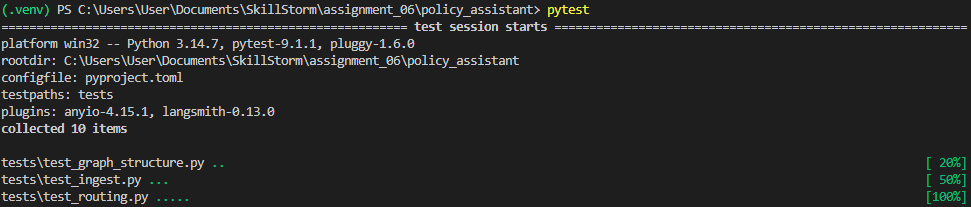
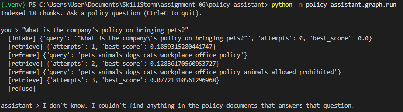
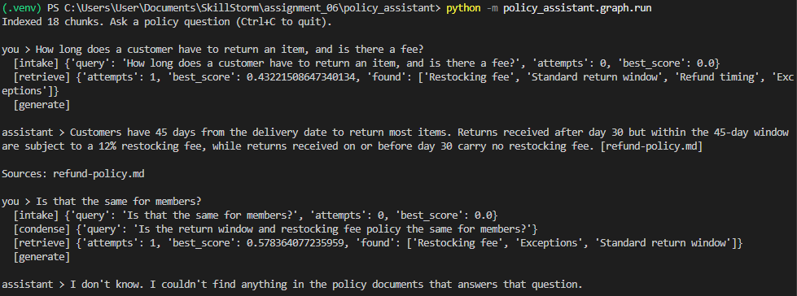
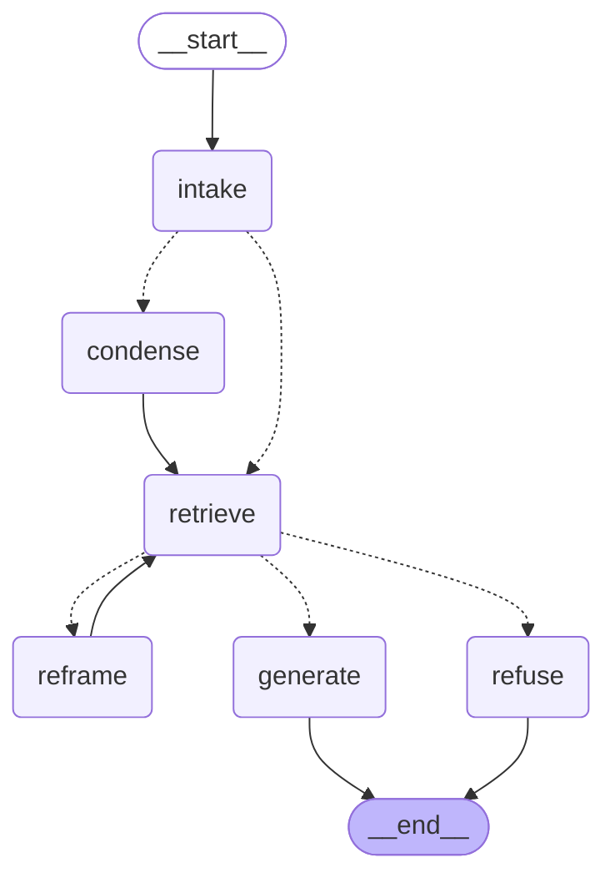

# Policy Assistant

A command-line assistant that answers questions about company policy from the documents in `kb-documents/`, built as a LangGraph graph.

## Setup

1. Install the project and the test tools:

   ```
   pip install -e ".[dev]"
   ```

2. Copy `.env.example` to `.env` and fill in the values.

### Environment variables

| Variable | Purpose |
|---|---|
| `AWS_REGION` | the AWS region that has your Bedrock models |
| `BEDROCK_MODEL_ID` | the chat model id |
| `EMBED_MODEL_ID` | the embedding model id |
| `BEDROCK_MAX_TOKENS` | optional, defaults to 600 |

## Tests

```
pytest
```



## Run

```
python -m policy_assistant.graph.run
```

## Example runs

### Question not covered by the documents

"What is the company's policy on bringing pets?" The documents say nothing about it, so the assistant says it does not know.



### Question covered by the documents, and a follow-up



## The graph

```
python -m policy_assistant.graph.graph
```



## Retry design

A search counts as weak when the best similarity score among the results is below the threshold in `config.py` (`DEFAULT_RETRIEVER_THRESHOLD`, currently 0.30).

On a retry, the `reframe` node asks the model for a new search query for the same question, using broader keywords and synonyms. It is told which queries have already failed. The question itself is not changed, only the search query.

## Retry bound

Each question gets at most 3 searches (`MAX_ATTEMPTS` in `config.py`): the first try and two retries.

The `attempts` counter is kept in the state and goes up by one on every search. The routing function only sends a weak result back to `reframe` while `attempts` is below the limit, so once the limit is reached there is no path back to `reframe` and the graph must end.

When the assistant runs out of attempts it replies: "I don't know. I couldn't find anything in the policy documents that answers that question."


## Other design details

- **Per-question reset:** the `intake` node clears the accumulating fields (queries tried, retrieved chunks) at the start of each question, so evidence doesn't leak between turns.
- **Multi-turn:** an in-memory checkpointer with one thread id per session keeps the conversation. The `condense` node rewrites follow-up questions as standalone questions before searching.
- **Safety net on the bound:** the graph run is capped at 25 steps, on top of the 3-search limit.
- **Testability:** routing and the retry bound are pure functions in `rules/`. The tests need no AWS or network.
